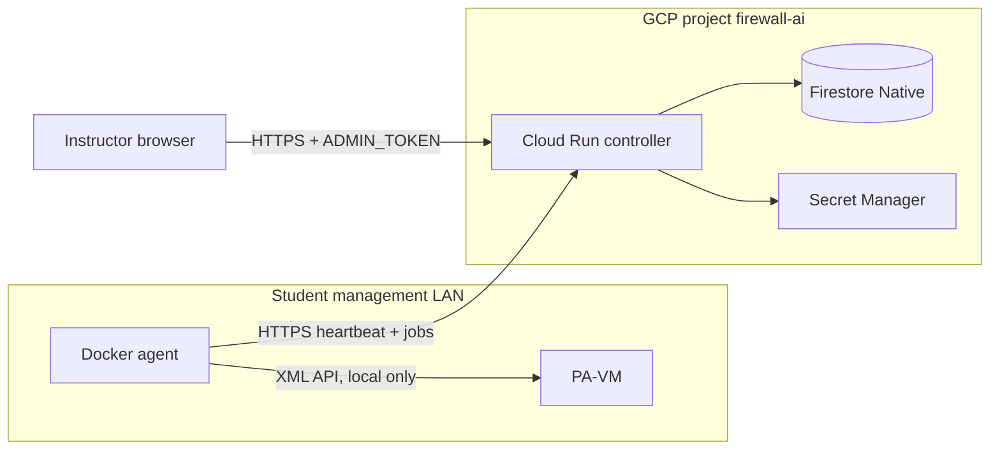

# Firewall AI

Instructor dashboard for Sheridan PAN-OS lab VMs. Each student runs a small Docker **agent** on the firewall **management** LAN. The agent checks the local PA-VM and calls home over HTTPS. Instructors see who is online. The controller never stores a firewall API key and never opens a VPN into a student home.

GCP project: **`firewall-ai`** · Region: **`northamerica-northeast2` (Toronto)**

## Architecture



This is the approved **agent-proxy** model (option 1). Details: [`docs/design.md`](docs/design.md). Security rules: [`SECURITY.md`](SECURITY.md).

## No secrets in git

- Never commit `.env`, service-account JSON, gcloud credential files, PAN-OS keys, or real tokens
- Copy `.env.example` → `.env` and use only `replace-me` / `YOUR_…` placeholders in examples
- PAN-OS API keys live **only** on the student agent (`FW_API_KEY`). They are not sent to Cloud Run, Firestore, or Secret Manager
- Rotate the class `ENROLLMENT_KEY` and `ADMIN_TOKEN` between terms (or immediately after a leak)

## Student quickstart

You need: Docker, outbound HTTPS (443) to the instructor’s Cloud Run URL, and Layer-3 reachability to your PA-VM management IP.

1. Get the class **enrollment key** and **controller URL** from your instructor (not from this repo).
2. On a host on the **management** network (same LAN as `172.16.10.222` or whatever your lab uses):

```bash
git clone https://github.com/sebbycorp/firewall-ai.git
cd firewall-ai/agent
cp .env.example .env
```

3. Edit `.env`:

```bash
CONTROLLER_URL=https://YOUR-CLOUD-RUN-SERVICE-XXXX.a.run.app
ENROLLMENT_KEY=replace-me-class-enrollment-key
STUDENT_ID=your.name@sheridancollege.ca
FW_HOST=https://172.16.10.222
FW_API_KEY=YOUR_PANOS_XML_API_KEY
HEARTBEAT_INTERVAL_SEC=30
FW_VERIFY_TLS=false
```

4. Create a PAN-OS API key used **only by this agent** (see below).
5. Start the agent:

```bash
docker compose up -d --build
docker compose logs -f
```

Compose uses `network_mode: host` on Linux so the container can reach the PA-VM the same way your laptop can. The agent enrolls, then every 30s: `show system info` → heartbeat → pull any `probe` jobs.

You should appear on the instructor board within a minute. If you see `firewall unreachable`, check `FW_HOST`, the API key, and that HTTPS to the management IP works from this host.

## How to create a PAN-OS API key

High-level path (PAN-OS 10/11 lab image):

1. Browse to the PA-VM **web UI** on the management IP (accept the self-signed cert).
2. Sign in as the lab admin user.
3. Prefer a dedicated local user with XML API / operational read rights rather than sharing a personal superuser password.
4. Generate an XML API key for that user:
   - **UI:** Device → XML API (or the logged-in user menu → API key), **or**
   - **API:** `https://<fw>/api/?type=keygen&user=<user>&password=<password>` — copy the `<key>` from the response, then close that browser tab
5. Paste the key only into the agent’s local `.env` as `FW_API_KEY`. Do not email it, paste it into Slack, or commit it.

Lab management certs are usually self-signed; leave `FW_VERIFY_TLS=false` unless you installed a trusted cert.

## Instructor deploy (GCP project `firewall-ai`)

Requires the `gcloud` CLI and permission on project `firewall-ai`.

```bash
gcloud auth login
gcloud config set project firewall-ai
./infra/setup.sh      # APIs, Firestore, secret *names*, IAM
./infra/deploy.sh     # Cloud Run from ./controller
```

`setup.sh` prompts for the class enrollment key and admin token; values go to Secret Manager. `deploy.sh` passes **secret names** into Cloud Run (`enrollment-key`, `admin-token`), never the raw values.

- Region: `northamerica-northeast2` (Toronto) for Cloud Run **and** Firestore. Fallback: `REGION=us-central1 ./infra/setup.sh`
- Cloud Run is `--allow-unauthenticated` so home labs can call `/v1/agents/*`. `/v1/labs` still requires `Authorization: Bearer <ADMIN_TOKEN>`
- Later hardening: Identity-Aware Proxy in front of the instructor UI (`/` and `/v1/labs*`). Leave agent routes public. See [`docs/design.md`](docs/design.md)

After deploy, give students the Cloud Run URL + enrollment key. Open the service URL, paste `ADMIN_TOKEN`, and you should see the status table (student id, online/offline, last_seen, hostname, PAN-OS version, mgmt IP, last_error). **Probe** enqueues an on-demand check; the student’s agent runs it on the next poll.

IAM summary is in [`infra/README.md`](infra/README.md).

### Local controller (no GCP)

```bash
cd controller
python3 -m venv .venv && source .venv/bin/activate
pip install -r requirements-dev.txt
ENROLLMENT_KEY=replace-me-class-enrollment-key \
ADMIN_TOKEN=replace-me-admin-token \
STORE_BACKEND=memory \
uvicorn app.main:app --reload --port 8080
```

Or: `docker compose up --build` from the repo root (in-memory store on `:8080`).

Point a test agent at `CONTROLLER_URL=http://127.0.0.1:8080` with `FW_HOST=mock` to exercise heartbeats without a firewall.

## API (minimum)

| Method | Path | Who |
| --- | --- | --- |
| `GET` | `/` | Instructor UI |
| `GET` | `/healthz` | Anyone |
| `POST` | `/v1/agents/enroll` | Class enrollment key |
| `POST` | `/v1/agents/{id}/heartbeat` | Agent token |
| `GET` | `/v1/agents/{id}/jobs` | Agent token |
| `POST` | `/v1/agents/{id}/jobs/{job_id}/result` | Agent token |
| `GET` | `/v1/labs` | `ADMIN_TOKEN` |
| `POST` | `/v1/labs/{student_id}/probe` | `ADMIN_TOKEN` |

A lab is **offline** when `last_seen` is older than 2 minutes (`OFFLINE_AFTER_SEC=120`).

## Repo layout

```
README.md
SECURITY.md
docs/design.md
.env.example
controller/     # FastAPI + instructor UI
agent/          # student container + docker-compose.yml
infra/          # gcloud setup + Cloud Run deploy
```

## Tests

```bash
pip install -r controller/requirements-dev.txt
pytest
docker compose -f agent/docker-compose.yml config
```

## Out of scope

VPN, NetBird, multi-vendor, grading, storing FW keys in Firestore/Secret Manager, SLATE.
